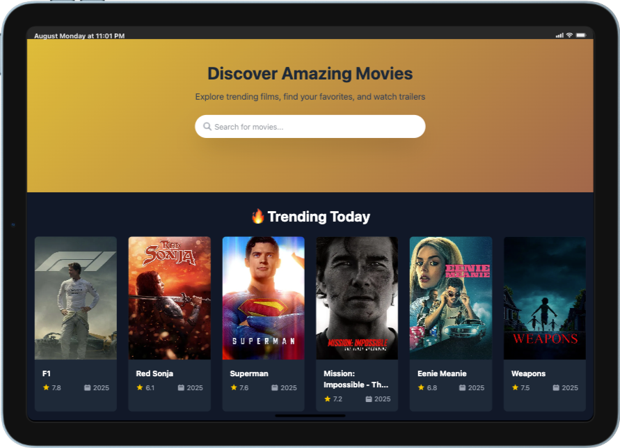

# Movies Explorer

A modern, responsive web application for discovering and exploring movies using The Movie Database (TMDB) API. Built with vanilla JavaScript, HTML5, and Tailwind CSS.

## 🌐 Live at: <a href="https://doumbiasoft.github.io/movies-explorer/" title="Try Demo" target="_blank">Try Demo</a>

## Screenshots

[](https://doumbiasoft.github.io/cat-explorer/)

## Features

### 🎬 Movie Discovery

- **Trending Movies**: View currently trending movies updated daily
- **Popular Movies**: Explore the most popular movies of all time
- **Search Functionality**: Real-time search with instant results
- **Movie Details**: Comprehensive movie information including ratings, budget, revenue, and more

### 🎨 User Interface

- **Cinematic Experience**: Full-screen movie backdrop displays in hero section
- **Responsive Design**: Works seamlessly on desktop, tablet, and mobile devices
- **Modern UI**: Clean, dark theme with smooth animations and transitions
- **Interactive Elements**: Hover effects, loading spinners, and smooth transitions

### 🎥 Media Features

- **Trailer Integration**: Watch movie trailers directly in the app
- **Image Gallery**: High-quality movie posters and backdrop images
- **Video Modal**: Full-screen trailer viewing with YouTube integration

### 📱 Technical Features

### Home View

- Hero section with search functionality
- Grid layout showing trending and popular movies
- Responsive movie cards with hover effects

### Movie Details View

- Full-screen movie backdrop in hero section
- Movie title and tagline overlay
- Detailed information panel with poster, ratings, and metadata
- Production company and country information
- Multiple trailer options

## Technology Stack

- **Frontend**: Vanilla JavaScript (ES6+), HTML5, CSS3
- **Styling**: Tailwind CSS (CDN)
- **API**: The Movie Database (TMDB) API v3
- **Icons**: Font Awesome
- **Media**: YouTube iframe integration for trailers

## Getting Started

### Prerequisites

- Modern web browser (Chrome, Firefox, Safari, Edge)
- TMDB API key (free from [https://www.themoviedb.org/](https://www.themoviedb.org/))

## Project Structure

```
movies-explorer/
├── index.html              # Main HTML file
├── styles/
│   └── app.css            # Custom CSS styles
├── scripts/
│   ├── index.mjs          # Main application logic
│   ├── tmdb-service.mjs   # TMDB API service
│   └── utilities.mjs      # Utility functions
├── images/
│   └── m-explorer.png     # App favicon and logo
└── README.md              # Project documentation
```

## API Integration

The app integrates with TMDB API endpoints:

- **Trending Movies**: `/trending/movie/day`
- **Popular Movies**: `/movie/popular`
- **Movie Search**: `/search/movie`
- **Movie Details**: `/movie/{id}`
- **Movie Videos**: `/movie/{id}/videos`

## Features in Detail

### Search Functionality

- Real-time search with 300ms debounce
- Displays results in responsive grid layout
- Shows "No results found" message for empty results
- Clears results when search input is empty

### Movie Details

- Dynamic hero background with movie backdrop
- Movie metadata including runtime, budget, revenue
- Genre tags with custom styling
- Production company and country information
- Multiple trailer support with primary trailer highlighting

### Responsive Design

- Mobile-first approach
- Breakpoints: Mobile (default), Tablet (md), Desktop (lg)
- Flexible grid layouts that adapt to screen size
- Touch-friendly interface elements

## Acknowledgments

- [The Movie Database (TMDB)](https://www.themoviedb.org/) for providing the movie data API
- [Tailwind CSS](https://tailwindcss.com/) for the utility-first CSS framework
- [Font Awesome](https://fontawesome.com/) for the beautiful icons

## 🤔 Project Reflection

### What could have been done differently during planning?

- **TypeScript Setup**: Using TypeScript from the start for better error catching and code maintainability

### What would be added with more time?

- **User Favorites System**: Allow users to save and manage their favorite movies with local storage
- **Advanced Filtering**: Filter movies by genre, year, rating, and other criteria
- **Movie Recommendations**: Show similar movies and personalized recommendations
- **User Reviews & Ratings**: Integration with user-generated content and reviews
- **Watchlist Feature**: Create and manage personal watchlists
- **Social Sharing**: Share movie discoveries on social media platforms
- **Performance Enhancements**:
  - Image lazy loading and optimization
  - Virtual scrolling for large movie lists
  - API response caching
- **Accessibility Improvements**:
  - ARIA labels and roles
  - Keyboard navigation support
  - Screen reader compatibility
- **Advanced Search**:
  - Search by actor, director, or production company
  - Auto-complete suggestions
